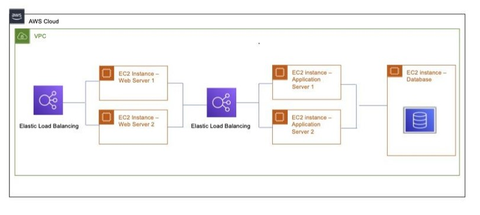

## Welcome

For our team’s CS6620 final project we took an existing bug tracking application (single page app) and hosted it on AWS. A bug tracking application digests requests from various users potentially around the globe.

This repository includes the application code as well as boto3 python scripts to deploy the application programatically.

## Deploy

Deploy the application programtically with no manual steps required

From /deploy
```console
python3 deploy_application.py
```

This scripts prints out the url of UI load balancer, which can be used to access the site (http).
Please wait for load balacers to be in Active state before trying to navigate to the site

IMPORTANT NOTE:
When running the above deploy script, we assume the AWS environment has a single VPC (default vpc).
Other than that, we assume the AWS environment is clean (no pre-exisitng security groups, load balancers, etc from previous runs of the script)

When running the script multiple times in a row, please delete anything created from previous runs


## Architecture



## Tech Stack

MERN Single Page Application