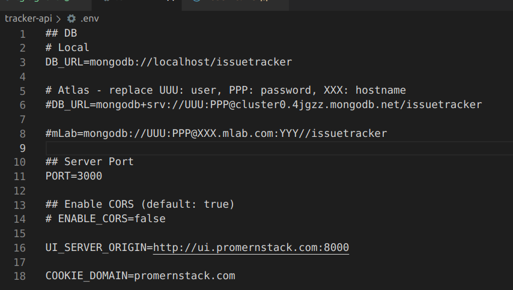

## Getting Started

Clone the github repo
(https://github.com/samk901/group4_project_cs6620)

### Installing Node

Install NVM to install/manage node versions\

(https://github.com/nvm-sh/nvm#install--update-script)

Try the following command, go to link above to resolve issues

```console
curl -o- https://raw.githubusercontent.com/nvm-sh/nvm/v0.39.1/install.sh | bash
```

Verify nvm has been installed, you should see nvm as output

```console
command -v nvm
```

Install and use Node 10.24.0. You should see "Now using node v10.24.0"

```console
nvm install 10.24.0
```

To change node version

```console
nvm use 10.24.0
```

2- Install mongo\
Install mongo, start mongod, verify it is running
[Installing MongoD](https://www.mongodb.com/docs/manual/administration/install-community/)

Navigate to tracker-api and initialize database

```console
mongo issuetracker init.mongo.js
```

You should see 2 insertions\

Populate database

```console
mongo issuetracker generate_data.mongo.js
```

You should see 100+ insertions\

## Tracker-api

-- Navigate to tracker-api directory\

Install node

```console
npm install
```

Create .env file in tracker-api directory


Start API application

```console
npm start
```

Application should connect to mongodb (will need at actually set this up)\
Application should start on port 3000\
You can see the graphql UI at "localhost:3000/graphql"\
Once we set up mongo you will be able to test the api through the gui

## Tracker-ui

-- In a new terminal navigate to tracker-ui directory\
-- Make sure that the tracker-api is up and running\

-- Install Dependencies\

```console
npm install
```

-- Compile the source code\

```console
npm run compile
```

-- Start the application locally\

```console
npm run start
```

Application should start on port 8000\
You should be able to see the barebones website at "localhost:8000"\
Application won't work without Google authentication, but you should be able to see the issues\

### Current Issues

-- Will need to enable Google Authentication in order to interact with the CRUD operations\
-- Setup Remote Database Cluster
-- CORS error when fetching data
